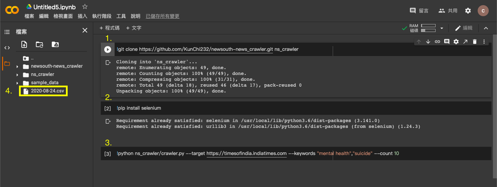

# Available sites
1. `https://www.who.int/southeastasia`
2. `https://www.who.int/westernpacific`
3. `https://www.psychiatry.org`
4. `https://timesofindia.indiatimes.com`
5. `https://thejakartapost.com`
6. `https://www.bangkokpost.com`

# Usage
For two keywords, each keyword with 10 results
```python
python crawler.py --target https://timesofindia.indiatimes.com --keywords "mental health","suicide" --count 10
```

# Requirements
* Chrome: lastest version
* [Chromedriver](https://chromedriver.chromium.org/downloads)
* pandas
* numpy
* selenium
* requests
* bs4

# [Google Colab](https://colab.research.google.com/)
`!git clone https://github.com/KunChi232/newsouth-news_crawler.git ns_crawler`

`!pip install selenium`

`!pip install python-dotenv`

`!python ns_crawler/crawler.py --target https://timesofindia.indiatimes.com --keywords "mental health","suicide" --count 10`

Then, it can get the final csv file with formatted with date.

Screenshot
